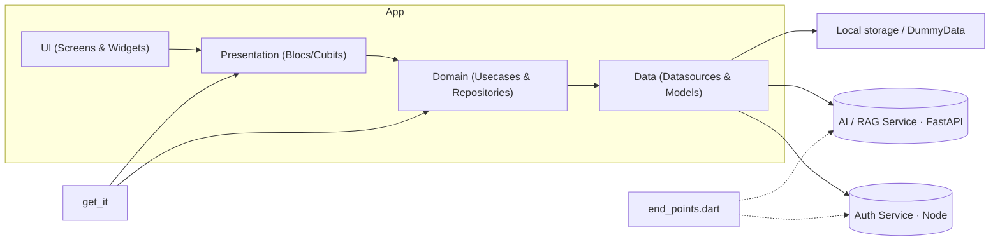

# Cultini — Flutter frontend

Mobile frontend for **Cultini**, a RAG-based anti-cultural-homogenization
project focused on Amazigh (Berber) craftsmanship in Algeria. The app talks to two
separate backends — a Node/Express auth service and a FastAPI AI/RAG service — and
keeps all AI logic server-side.

## Tech stack

- **Flutter** & **Dart** (SDK `^3.11.0`)
- **State management:** `flutter_bloc` `^9.1` (Bloc + Cubit)
- **Dependency injection:** `get_it` `^9.2` (`lib/di/injection_container.dart`)
- **Networking:** `http` `^1.6` wrapped in `ApiClient` (`lib/core/network/api_client.dart`)
- **Navigation:** `go_router` `^17` (top-level) + imperative `Navigator` for detail screens
- **Maps:** `flutter_map` `^7` + `latlong2` over OpenStreetMap tiles
- **Local storage:** `shared_preferences` / `flutter_secure_storage` via `AppLocalStorage`
- **Config:** `flutter_dotenv` `^6` (`.env`)
- Plus `dartz` (Either), `equatable`, `google_fonts`, and connectivity helpers.

## Features

- **Authentication** (login / register / splash) — Node/Express auth service.
- **AI / RAG chat** — FastAPI service, streamed token-by-token over Server-Sent
  Events, showing source nodes and cultural-coverage metrics.
- **Documentation browser** — searchable and filterable; currently served from local
  mock data (`DummyData`).
- **Contribution form** — validated submissions posted to the FastAPI backend, which
  auto-filters and queues them for moderation.
- **Map of wilayas** — tappable markers that open the Documentation pre-filtered by
  region.
- **Profile** — signed-in user info and logout.

## Architecture overview

Clean architecture, one slice per feature:

- `domain/` — entities, repository interfaces, usecases
- `data/` — models, datasources (remote/local), repository implementations
- `presentation/` — blocs/cubits, screens, widgets

Every backend interaction goes through a repository interface in `domain/repositories/`
implemented in `data/repositories/`, which delegates to datasources
(`*_remote_data_source.dart` for HTTP, `*_local_data_source.dart` for cache/mock).
No widget touches HTTP directly. Swapping mock for real is a binding change in
`lib/di/injection_container.dart`.

## Project structure

```
lib/
├── main.dart                         # entrypoint: load .env, init DI, launch app
├── di/injection_container.dart       # get_it registrations (incl. named 'ai' ApiClient)
├── navigation/main_navigation.dart   # bottom-nav shell (Map · Docs · Chat · Contribuer · Profil)
├── core/
│   ├── constants/                    # end_points.dart (base URLs + paths), app_strings, storage_keys
│   ├── network/                      # api_client.dart, network_info.dart
│   ├── storage/                      # app_local_storage.dart
│   ├── router/                       # app_router.dart (go_router) + app_routes.dart
│   ├── theme/                        # ThemeData + color/metric/text tokens
│   ├── validators/                   # AppValidators (email, password, …)
│   ├── widgets/                      # custom_button, custom_text_field, azetta_motif
│   ├── extensions/ · errors/ · usecase/
│   └── data/dummy_data.dart          # mock corpus for Documentation (no backend yet)
└── features/
    ├── auth/                         # login/register/splash → Node /api/auth, AuthBloc
    ├── chat/                         # AI chat → FastAPI /chat (SSE), sources + metrics
    ├── docs/                         # searchable/filterable documentation + detail (mock)
    ├── contribution/                 # validated form → FastAPI /contributions
    ├── map/                          # tappable wilayas → Documentation pre-filtered
    └── profile/                      # signed-in user + logout
```

## Feature / backend status

| Feature | Today | Backend |
| --- | --- | --- |
| Auth | **Live HTTP** | Node/Express `POST /api/auth/{login,register}` |
| Chat | **Live HTTP (SSE stream)** | FastAPI `POST /chat` `{chat_id, question}` → SSE stream of meta / token / done frames |
| Documentation | **Mock** (`DummyData`) | none yet — `DocsRemoteDataSource` is scaffolded (throws `UnimplementedError`) |
| Contribution | **Live HTTP** | FastAPI `POST /contributions` → `{accepted, status, message}` (auto-filter + moderation queue); accepted items also cached locally |
| Map / wilayas | **Static** wilaya list | none needed |

## Prerequisites

- Flutter SDK (stable channel) compatible with Dart `^3.11.0`
- Android SDK / Xcode for mobile, or Chrome for web
- `cultini-backend` (Node/Express) on `:3000` for auth
- `cultini_AI` (FastAPI) on `:8000` for chat and contributions

```bash
flutter pub get
```

## Environment (.env)

Base URLs are centralized in `lib/core/constants/end_points.dart` and read from `.env`.
Copy the example and adjust for your environment:

```bash
cp .env.example .env
```

```dotenv
# .env  — Android emulator example (10.0.2.2 = the host machine)
AUTH_BASE_URL=http://10.0.2.2:3000   # Node/Express (cultini-backend)
AI_BASE_URL=http://10.0.2.2:8000     # FastAPI (cultini_AI)
```

- Use `http://localhost` on the iOS simulator / desktop, or your machine's LAN IP
  (e.g. `http://192.168.1.20:3000`) for a physical device.
- DI registers a default `ApiClient` targeting `AUTH_BASE_URL` and a second named
  instance (`instanceName: 'ai'`) targeting `AI_BASE_URL`; the latter is injected into
  the **chat** and **contribution** datasources.

## Running

```bash
flutter pub get
flutter run            # connected device / emulator (use -d chrome for web)
flutter analyze        # static analysis
```

- For the Android emulator, `10.0.2.2` refers to the host machine.
- Start the backends first if you want auth, chat, or contributions; Map and
  Documentation work offline on mock data (the OSM basemap still needs network to
  render tiles, but wilaya markers are tappable regardless).

## API integration

The networking layer is `lib/core/network/api_client.dart`; endpoint paths live in
`lib/core/constants/end_points.dart`.

### Auth (login)

```bash
curl -X POST "$AUTH_BASE_URL/api/auth/login" \
  -H "Content-Type: application/json" \
  -d '{"email":"user@example.com","password":"password"}'
# → {"token":"<jwt>","user":{"id":"...","name":"...","email":"..."}}
```

### Chat (RAG, Server-Sent Events)

`/chat` is **not** a plain JSON endpoint — it returns an SSE stream. The chat
datasource uses `ApiClient.postStream()` and parses `data:` frames into a union of
events: `ChatMetaEvent` (route + source nodes), `ChatTokenEvent` (a response delta),
`ChatDoneEvent` (final metrics), and `ChatErrorEvent`.

```bash
curl -N -X POST "$AI_BASE_URL/chat" \
  -H "Content-Type: application/json" \
  -d '{"chat_id":"<id>","question":"Tell me about pottery in Tizi Ouzou"}'
# → text/event-stream: a sequence of "data: {...}" frames (meta, then tokens, then done)
```

### Contribution (FastAPI auto-filter + moderation)

The form collects `wilaya`, which is sent as `region`; `categorie` is sent as its
API value (e.g. `savoir-faire`).

```bash
curl -X POST "$AI_BASE_URL/contributions" \
  -H "Content-Type: application/json" \
  -d '{"titre":"...","categorie":"pottery","region":"Tizi Ouzou","contenu":"...","source":"...","contributor_name":"..."}'
# → {"accepted": true, "status": "pending", "message": "..."}
```

The client reads `{accepted, status, message}` from the response. (The backend also
returns `id` and `flags`, which the app ignores.)

## Pointing the Documentation feature at a real backend

The Documentation feature currently reads `DummyData.docEntries` via
`DocsLocalDataSourceImpl`. To wire a real endpoint later:

1. Add the path to `EndPoints` and implement `DocsRemoteDataSource.getEntries`.
2. Have `DocsRepositoryImpl` prefer remote (online-first) with the local mock as fallback.
3. Update the binding in `lib/di/injection_container.dart` and restart.

## Testing

```bash
flutter test
```

Tests live in `test/` — `cultini_test.dart` covers `DocsState.filtered()`,
`ChatMetricsModel.fromJson()`, the `DocCategory` API round-trip, and `AppValidators`;
`widget_test.dart` is the default boilerplate.

> **Note:** `flutter test` cannot run while the project sits under a path containing an
> apostrophe (`…/Github Repo's/…`). Flutter's generated test listener embeds the path in
> a single-quoted string and the apostrophe breaks it. The tests are valid (covered by
> `flutter analyze`) and pass once the project is in an apostrophe-free path.

## Troubleshooting

- **Network errors** — make sure the emulator/device can reach the URLs in `.env`
  (`10.0.2.2` for the Android emulator, LAN IP for a physical device).
- **Chat shows nothing** — confirm `cultini_AI` is running on `AI_BASE_URL` and that
  the SSE stream is reachable; the client expects `text/event-stream`, not JSON.
- **Auth fails** — verify `cultini-backend` is up on `AUTH_BASE_URL` and the request
  payload matches the examples above.
- **`flutter test` syntax errors** — check the project path for apostrophes (see above).

## Architecture diagram


