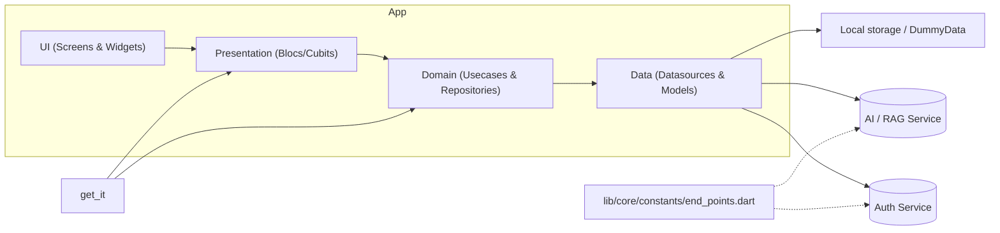

# Cultini — Flutter frontend

Mobile frontend for **Cultini / Azetta**, a RAG-based anti-cultural-homogenization
project focused on Amazigh (Berber) craftsmanship in Algeria. This app talks to two
separate backends (auth + AI/RAG); all AI logic lives server-side.

## Stack

- **Flutter** + **Dart**
- **State management:** `flutter_bloc` (Bloc + Cubit)
- **Dependency injection:** `get_it` (`lib/di/injection_container.dart`)
- **Networking:** `http` wrapped in `ApiClient` (`lib/core/network/api_client.dart`)
- **Navigation:** `go_router` (top-level) + imperative `Navigator` for detail screens
- **Maps:** `flutter_map` + OpenStreetMap tiles (one tappable marker per wilaya)
- **Local storage:** `shared_preferences` / `flutter_secure_storage` via `AppLocalStorage`
- **Config:** `flutter_dotenv` (`.env`)

# Cultini — Flutter frontend

Cultini is the Flutter mobile frontend for the Cultini / Azetta project — a RAG-powered
platform focused on documenting and promoting Amazigh (Berber) craftsmanship. The app
integrates with two backends (authentication + AI/RAG); all AI processing and retrieval
logic run server-side.

## Quick links

- Project root: `README.md`
- App entrypoint: `lib/main.dart`
- Dependency injection: `lib/di/injection_container.dart`
- Network client: `lib/core/network/api_client.dart`
- Endpoints/config: `lib/core/constants/end_points.dart`

## Features

- Authentication (login/register) — talks to a Node/Express auth service
- Conversational AI / RAG chat — talks to a FastAPI AI service and shows source nodes
- Documentation browser — searchable, filterable; currently serves from local mock data
- Contribution form — validated suggestions sent to the FastAPI backend (`POST /contributions`) for auto-filtering + moderation; a local copy of accepted submissions is kept best-effort
- Map of 58 wilayas with tappable markers pre-filtering documentation
- Profile screen with user info and logout

## Tech stack

- Flutter & Dart
- State management: `flutter_bloc` (Bloc + Cubit)
- Navigation: `go_router` (top-level) + imperative `Navigator` for deep/details
- Dependency injection: `get_it`
- HTTP: `http` wrapped by a project `ApiClient`
- Local storage: `shared_preferences` and `flutter_secure_storage` via `AppLocalStorage`
- Environment config: `flutter_dotenv`

## Architecture overview

Clean architecture per feature:

- `domain/` — entities, repository interfaces, usecases
- `data/` — models, datasources (remote/local), repository implementations
- `presentation/` — blocs/cubits, screens, widgets

All backend access goes through repository interfaces. Implementations delegate to
datasources (`*_remote_data_source.dart` for HTTP calls, `*_local_data_source.dart` for
mock/cache). Swapping mock and real implementations is done via the DI bindings in
`lib/di/injection_container.dart`.

## Repository layout (high level)

Important folders and files:

- `lib/main.dart` — application entrypoint and top-level router initialization
- `lib/di/injection_container.dart` — `get_it` registrations and environment bindings
- `lib/core/network/api_client.dart` — centralized HTTP client, timeout, interceptors
- `lib/core/constants/end_points.dart` — base URLs and API paths (reads from `.env`)
- `lib/core/storage/app_local_storage.dart` — local storage wrapper
- `lib/core/router/app_router.dart` — `go_router` configuration and route names
- `lib/navigation/main_navigation.dart` — bottom navigation shell

Feature roots: `lib/features/{auth,chat,docs,contribution,map,profile}`

## Prerequisites

- Flutter SDK (stable channel) — recommended: latest stable
- Android SDK / Xcode (if building for mobile) or Chrome for web
- `cultini-backend` (Node/Express) running on :3000 for auth (optional for offline)
- `cultini_AI` (FastAPI) running on :8000 for chat (optional for offline)

Install Flutter packages:

```bash
flutter pub get
```

## Environment (.env)

Copy the example and set service URLs appropriate for your environment:

```bash
cp .env.example .env
# Edit .env and set AUTH_BASE_URL and AI_BASE_URL
```

Example `.env` values for Android emulator:

```dotenv
AUTH_BASE_URL=http://10.0.2.2:3000
AI_BASE_URL=http://10.0.2.2:8000
```

- Use `localhost` on desktop / iOS simulator, or your machine's LAN IP for a physical device.
- The project injects a named `ApiClient` instance for AI (`instanceName: 'ai'`).

## Running the app

Common commands:

```bash
flutter pub get
flutter run            # run on connected device or default emulator (use -d chrome for web)
flutter analyze        # static analysis
```

Tips:

- For Android emulator, `10.0.2.2` refers to the host machine.
- If you run the Node/AI backends locally, start them first and update `.env`.

## API examples

Auth (login):

```bash
curl -X POST "$AUTH_BASE_URL/api/auth/login" \
  -H "Content-Type: application/json" \
  -d '{"email":"user@example.com","password":"password"}'
```

Chat (RAG):

```bash
curl -X POST "$AI_BASE_URL/chat" \
  -H "Content-Type: application/json" \
  -d '{"chat_id":"<id>","question":"Tell me about pottery in Wilaya X"}'
```

Contribution (FastAPI auto-filter + moderation):

```bash
curl -X POST "$AI_BASE_URL/contributions" \
  -H "Content-Type: application/json" \
  -d '{"titre":"...","categorie":"pottery","region":"Tizi Ouzou","contenu":"...","source":"...","contributor_name":"..."}'
# → {"accepted": true, "status": "pending", "message": "..."}
```

Replace environment variables or expand the URLs from `lib/core/constants/end_points.dart`.

## Development notes

- Dependency injection: inspect `lib/di/injection_container.dart` to see registrations
  and how mocks vs real datasources are bound.
- Networking: `lib/core/network/api_client.dart` centralizes headers, timeouts and
  error handling; feature remote data sources call it.
- Repositories: each feature exposes a repository interface in `domain/repositories` and
  an implementation in `data/repositories` that composes datasources.
- Mock data: `lib/core/data/dummy_data.dart` is used by the documentation feature.

How to swap mock → real for a feature:

1. Implement the remote datasource (if scaffolded) or update the existing one.
2. Update bindings in `lib/di/injection_container.dart` to register the remote
   implementation in place of the local/mock one.
3. Restart the app.

## Testing

Unit and widget tests live in the `test/` directory. Run tests with:

```bash
flutter test
```

Important: `flutter test` may fail if the project path contains an apostrophe
(e.g., `Github Repo's`) due to a limitation in the generated test listener embedding
the path in a single-quoted string. If you encounter syntax errors during `flutter test`,
move the project to a path without apostrophes and retry.

Continuous integration: recommended steps for CI

1. Install Flutter on the runner
2. Run `flutter pub get`
3. Run `flutter analyze` and `flutter test`

## Troubleshooting

- Network issues: ensure emulator/device can reach the host URLs in `.env`.
- If auth or chat responses are unexpected, verify backend health and request payloads
  using the API examples above.
- If tests fail unexpectedly, check the project path for special characters (apostrophes).

## Contributing

1. Fork the repository and open a feature branch.
2. Add tests for new logic where appropriate.
3. Open a pull request describing the change and any required backend updates.

## License & contact

This repository follows the licensing stated by the Cultini organization — add LICENSE
file as appropriate. For questions, contact the maintainers listed in project metadata.

---

## Architecture diagram

Below is a high-level architecture diagram (Mermaid) showing how the app layers
interact with dependency injection, backends and local storage.



If you want, I can also add an example CI config or sample backend stubs for local
development.
> Clean architecture per feature: `domain` (entities, repository interfaces, usecases) →
> `data` (models, datasources, repository impls) → `presentation` (bloc/cubit, screens, widgets).

## Project structure

```
lib/
├── core/                     # shared infrastructure
│   ├── constants/            # end_points.dart (base URLs + paths), app_strings, storage_keys
│   ├── network/              # api_client.dart, network_info.dart
│   ├── storage/              # app_local_storage.dart
│   ├── theme/                # single ThemeData + color/metric/text tokens
│   ├── router/               # go_router config + route names
│   ├── validators/           # AppValidators (email, password, …)
│   ├── widgets/              # AppTextField, PrimaryButton, …
│   └── data/dummy_data.dart  # mock corpus for Documentation (no backend yet)
├── di/injection_container.dart   # get_it registrations
├── navigation/main_navigation.dart  # bottom-nav shell (Map · Docs · Chat · Contribuer · Profil)
└── features/
    ├── auth/                 # login/register/splash → Node /api/auth, AuthBloc
    ├── chat/                 # AI chat → FastAPI /chat, sources + metrics
    ├── docs/                 # searchable/filterable documentation + detail (mock)
    ├── contribution/         # validated suggestion form → FastAPI /contributions (auto-filter + moderation)
    ├── map/                  # 58 tappable wilayas → Documentation pre-filtered
    └── profile/              # signed-in user + logout
```

## Repository pattern (mock ↔ real)

Every backend interaction goes through a **repository interface** in `domain/repositories/`,
implemented in `data/repositories/`. Implementations delegate to **datasources**
(`*_remote_data_source.dart` for HTTP, `*_local_data_source.dart` for cache/mock). Swapping
mock for real means changing a datasource/binding — no widget touches HTTP directly.

| Feature | Today | Backend |
|---|---|---|
| Auth | **Live HTTP** | Node/Express `POST /api/auth/{login,register}` |
| Chat | **Live HTTP** | FastAPI `POST /chat` `{chat_id, question}` → `{response, source_nodes[], metrics}` |
| Documentation | **Mock** (`DummyData`, corpus-derived) | none yet — `DocsRemoteDataSource` is scaffolded |
| Contribution | **Live HTTP** | FastAPI `POST /contributions` `{titre, categorie, region, contenu, source, contributor_name}` → `{accepted, status, message}` (auto-filter + moderation queue); accepted items are also cached locally |
| Map / wilayas | **Static** list of 58 wilayas | none needed |

## Pointing at a real backend

Base URLs are centralized in `lib/core/constants/end_points.dart` and read from `.env`:

```dotenv
# .env  (copy from .env.example)
AUTH_BASE_URL=http://10.0.2.2:3000   # Node/Express (cultini-backend)
AI_BASE_URL=http://10.0.2.2:8000     # FastAPI (cultini_AI)
```

- `10.0.2.2` is the host machine from the **Android emulator**. Use `http://localhost` for the
  iOS simulator / desktop, or your machine's LAN IP for a physical device.
- The default `ApiClient` targets `AUTH_BASE_URL`; a second named instance (`instanceName: 'ai'`)
  targets `AI_BASE_URL` and is injected into the chat datasource.
- To enable a future Documentation endpoint: add its path to `EndPoints`, implement
  `DocsRemoteDataSource.getEntries`, and have `DocsRepositoryImpl` prefer remote (online-first)
  with the local mock as fallback.

## Running

```bash
flutter pub get
flutter run            # emulator / device   (use -d chrome for web)
flutter analyze        # static analysis — currently clean
```

Auth, chat, and contribution require their backends running (start `cultini-backend` on :3000
for auth and `cultini_AI` on :8000 for chat + contributions, then set the base URLs above).
Map and Documentation work fully offline on mock data. The OSM basemap needs network to render
tiles; wilaya markers are tappable regardless.

> **Note:** `flutter test` cannot run while the project sits under a path containing an
> apostrophe (`…/Github Repo's/…`) — Flutter's generated test listener embeds the path in a
> single-quoted string and the apostrophe breaks it. The tests in `test/cultini_test.dart`
> are valid (covered by `flutter analyze`) and pass once the project is in an apostrophe-free path.
